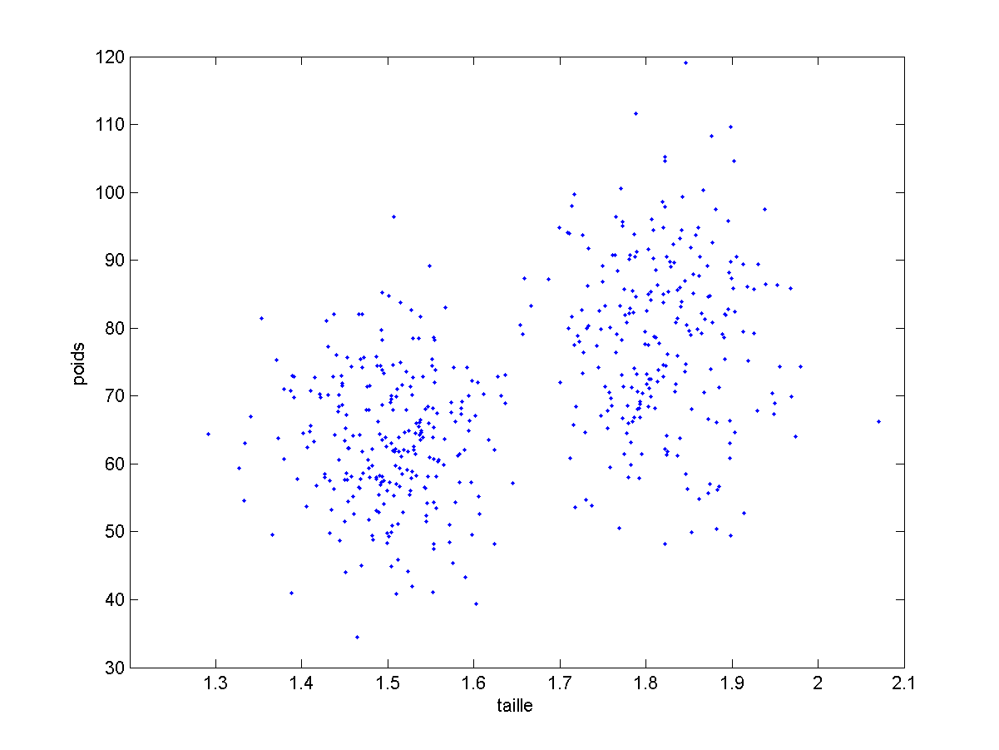
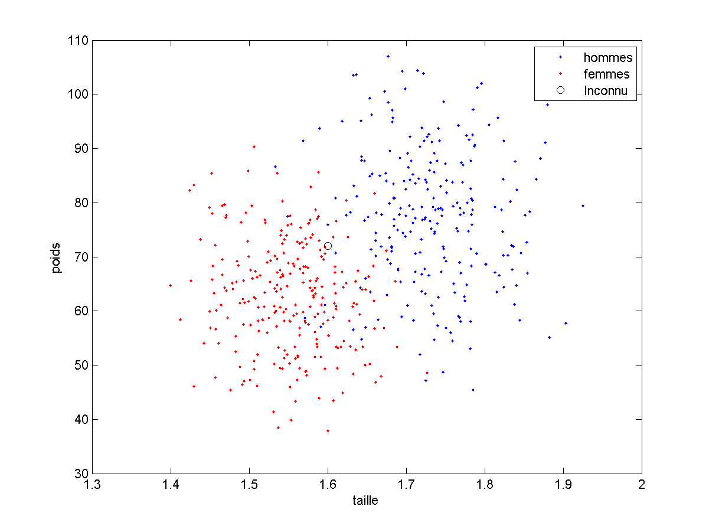
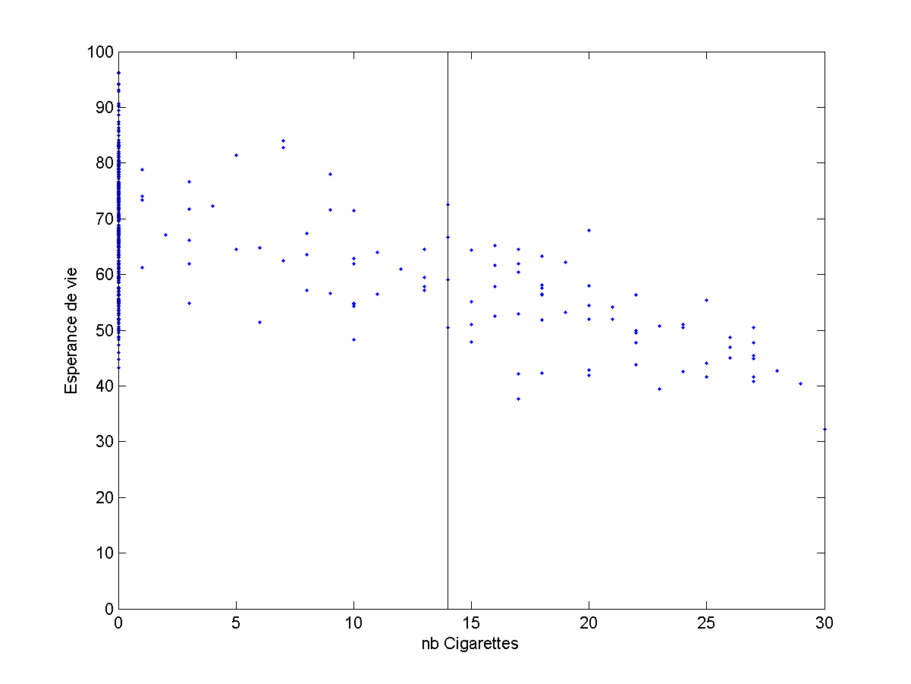

## Principes de l'Apprentissage automatique

Içi, sans trop détailler, je vais essayer de vous expliquer les principes de
l'apprentissage automatique, et même vous orienter vers des débuts de solutions
classiques aux trois problèmes évoqués dans l'introduction.

Commençons par un peu de philosophie : Nous cherchons  à concevoir une solution
pour qu'un programme apprenne, sur la base d'exemples, à prendre une décision
concernant un objet ou une situation.

Pour avancer dans ce problème, il nous faut impérativement une image mentale
de notre problème. Qu'est ce qui peut nous fournir une image mentale sur laquelle
nous pourrons ensuite faire des calculs : Les **mathématiques**.

### Les Applications

#### Application au Clustering

Re-simplifions notre exemple de l'introduction, et intéressons nous par exemple
au problème du **clustering** qui consiste à regrouper nos exemples en
groupes (des **clusters**). Nous voudrions visualiser nos exemples.

Un exemple sera ici constitué de 2 informations :
- taille
- poids

On peut penser chaque exemple comme un point (ou un vecteur) dans un espace de
dimension 2.
Dans le tableau qui suit : chaque ligne est une personne (homme ou femme indifférenciés) et sur une ligne, on trouve le **vecteur de caractéristiques**
[taille, poids] de la personne. Nos données ont la forme suivante :

Taille | Poids
------ | -----
1.8707 |  68.7103
1.5430 |  63.2235
1.8442 |  88.0109
1.6772 |  70.5969
...    |  ...
1.6072 |  66.1378

Avec ce tableau, je pourrais faire toutes sortes de calculs, mais je peux surtout
visualiser mes données :

*Remarque : pour que l'exemple soit plus parlant, j'ai modifié les valeurs réelles
de taille et de poids des francais. Je reviendrais plus tard aux véritables
valeurs.*

Voyez vous deux groupes de personnes ?

#### Application au Clustering

Reprenons notre exemple simplifié précédent. Nous voudrions à partir d'exemples
connus, apprendre à déduire le sexe d'un individu inconnu. Pour cela, il faut impérativement que pour chaque exemple connu, nous sachions quel est son sexe.

Nous aurons donc des exemples connus :

Taille | Poids    | catégorie
------ | -----    | ---------
1.8707 |  68.7103 | homme
1.5430 |  63.2235 | femme
1.8442 |  88.0109 | homme
1.6772 |  70.5969 | femme
...    |  ...
1.6072 |  66.1378 | femme

et enfin un ou plusieurs exemples inconnus à propos desquels il faudra prendre
une décision :

Taille | Poids
------ | -----
1.60 |  72

Encore une fois, avec ce tableau, je pourrais faire toutes sortes de calculs, mais je peux surtout visualiser mes données :

*Remarque : pour que l'exemple soit plus parlant, j'ai modifié les valeurs réelles
de taille et de poids des francais. Je reviendrais plus tard aux véritables
valeurs.*

Pouvez vous prendre une décision concernant le point inconnu ?
Pourriez vous décrire un programme qui prenne cette décision ?

#### Application à la Régression

Encore une fois, je vais re-simplifier l'exemple précédent pour des questions
de visualisation. La version complète arrivera plus tard.

Nous disposons d'exemples connus dont nous connaissons le nombre de cigarettes
qu'ils fument par jour. Nous voudrions, pour un individu inconnu, déduire son espérance de vie. Pour cela, il faut impérativement que pour chaque exemple connu, nous sachions quel est son espérance de vie.

*Notez qu'ici, j'ai littéralement complètement inventé les chiffres utilisés
pour mes exemples...*

Nous aurons donc des exemples connus :

nb Clopes | Esperance de vie
------ | -----
22  |   74
0   | 45
0   | 84
22  | 51
0   | 90
10  | 72
4   | 67
... | ...
0   | 69

Et nous voulons savoir quelle serait l'espérance de vie d'un inconnu dont les caractéristiques sont les suivantes :

nb Clopes : 14

Encore une fois, avec ce tableau, je pourrais faire toutes sortes de calculs, mais je peux surtout visualiser mes données : Notre programme doit choisir une valeur en ordonnée sur la ligne noire.

TODO : AJOUTER un graphique clopes / alcool

#### Conclusion sur ces applications

Ce n'est pas détaillé dans ce document (pas eu le temps) mais nous avons vu
en cours qu'une solution pouvait s'appuyer sur la notion de distance.
Pour la classification ou la régression, pour prendre une décision
sur un exemple inconnu, on peut chercher :

- le plus proche voisin parmi les exemples connus
- les k plus proches voisins parmi les exemples connus et combiner les résultats obtenus par chacun de ces voisins (moyenne ou vote)

A ce stade, nous avons posé le contexte et vous avez quelques idées sur des solutions potentielles. Pour aller plus loin, il va falloir rendre tout cela un peu plus carré et donc formaliser un peu ces problèmes

___

Vous pouvez repartir vers le [Sommaire](99_sommaire.md)
___
