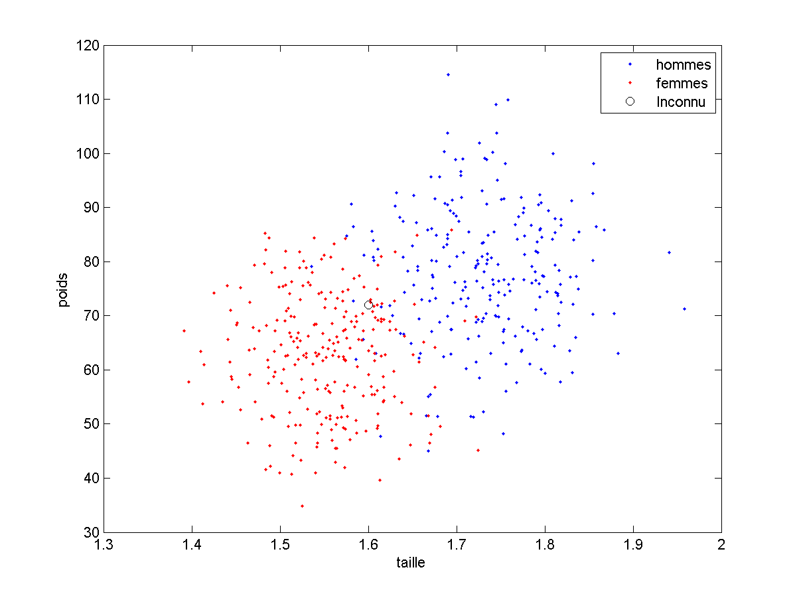
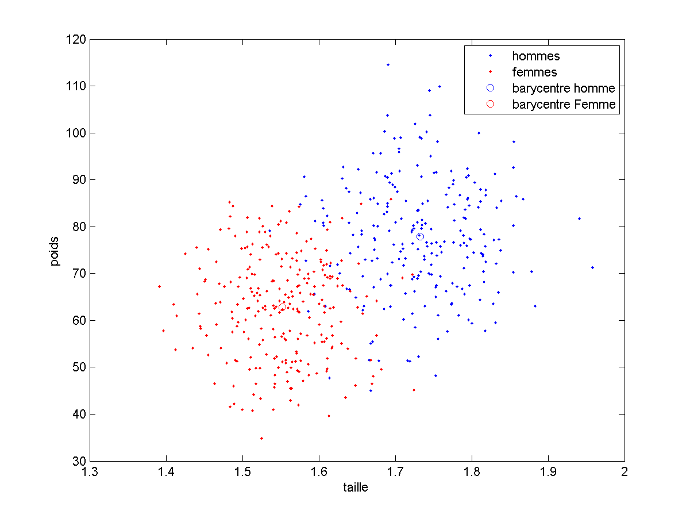
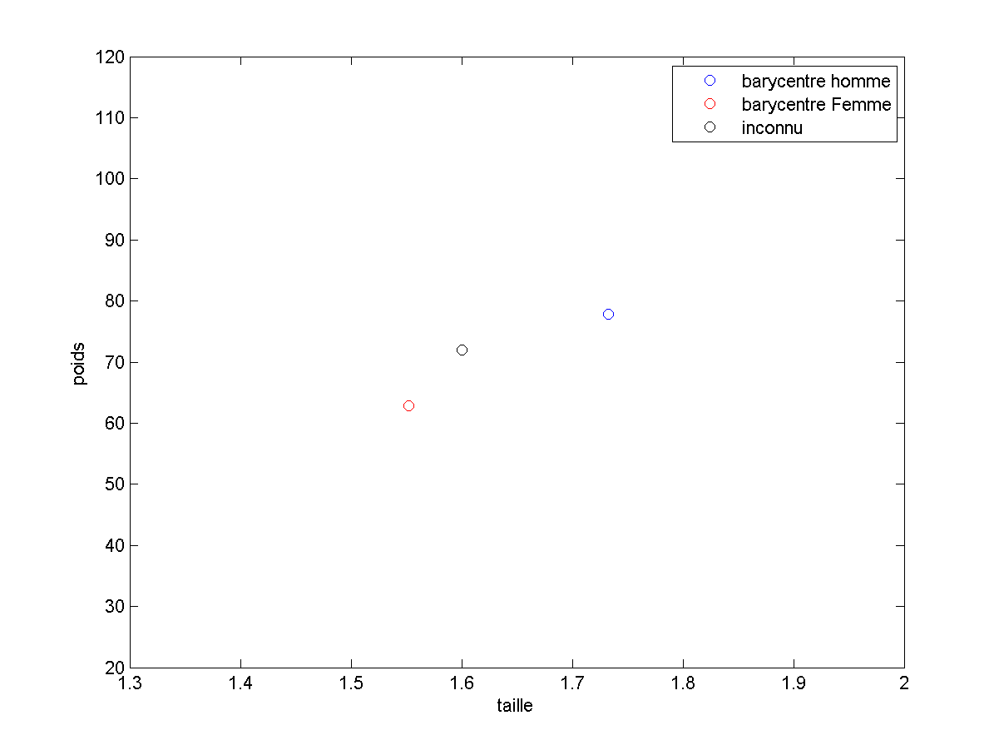

# Cours 2

## L'instant Philo.

Notre intelligence vs intelligence Artificielle :
Interaction des modules...
Retour sur les medecins.
TODO

## Formalisation

Rappelons l'objectif, pour l'exemple de la classification :

Ce que nous cherchons à mettre au point n'est pas un programme qui reconnaisse
au mieux les hommes et les femmes sur la base de leur poids et de leur taille,
mais un programme qui, si on lui donne des exemples de (taille, poids, sexe)
sera capable de choisir un sexe pour n'importe quelle valeur (taille, poids).

Il s'agit donc de se détacher du problème précis, pour trouver des solutions plus
ou moins universelles à ces problèmes généraux.

Mais comme nous devons discuter de ces problèmes, il nous faut un peu de
vocabulaire...

### Le vecteur de caractéristiques

Tout d'abord, nous étudions un objet ou une situation, souvent définis par des
nombres (pas toujours, voir les différents [types de caractéristiques](HyperLinks/featureTypes.md)).
Ces nombres sont rangés dans un *vecteur*, que l'on nomme **vecteur de
caractéristiques**, ou encore **feature vector** en anglais.

- Dans les les applications de clustering et de classification que nous avons vues, notre vecteur de caractéristiques était le vecteur *[taille, poids]*.
- Dans le cas de la régression présentée au cours 1, les informations dont nous disposions étaient une seule valeur (*nbClopes*) que l'on peut voir comme un vecteur de dimension 1 *[nbClopes]*

La taille de ce vecteur est extrêmement importante (en gros, plus ce vecteur
sera grand, plus il faudra d'exemples pour apprendre). Cette taille est appelée **dimension de l'espace des caractéristiques**.
L'importance de cette dimenson est abordée dans la page de
[la malédiction de la dimensionalité](HyperLinks/curseOfDim.md)

C'est de cet espace dont nous allons parler maintenant.

### L'espace des caractéristiques

Si on considère les caractéristiques de chaque exemple comme un vecteur, ce
vecteur appartient à un espace vectoriel : l'**espace des caractéristiques**.
C'est l'ensemble de positions possibles pour nos exemples.

Pour simplifier, on pourrait considérer que cet espace des caractéristiques est
- R² lorsque le vecteur de caractéristiques est [tailles, poids]
- R lorsque le vecteur de caractéristiques est [nbClopes]

Notez que nous travaillerons couramment avec des espaces de caractéristiques de
dimensions 3,4, 10 ou 100. Une branche complète de l'apprentissage automatique
s'intéresse aux espaces de grandes dimensions, c'est ce que l'on nomme **Big
Data** (en fait, cela devient du big data quand il y a vraiment beaucoup
d'exemples. Notez que ce terme est en voie de désaffection car en sciences aussi,
il y a des modes...)

Notez également que l'on ne peut pas visualiser réellement des exemples dans des
espaces de dimension > 3 (Vous pourriez aller voir [visualiser les données](HyperLinks/visualise.md) si ce cas vous intéresse).
Ceci ne nous empêche pas de réfléchir et de calculer dans ce type d'espaces.

### Apprentissage Supervisé vs Apprentissage Non Supervisé

Si on regarde les choses de loin, on peut remarquer quelque chose :
dans l'application de **clustering**, nous ne disposons à propos de nos exemples
que de leur **vecteur de caractéristiques**.

Le problème de clustering est un problème dit d'**Apprentissage Non Supervisé**
(ou *unsupervised learning* en anglais).
Le programme doit apprendre avec les données, sans savoir ce que l'on attend de
lui.

En revanche, pour de la **classification** ou la **régression**, nos
informations à propos de nos exemples sont leur **vecteur de caractéristiques**
et une **vérité terrain** :
- pour la classification, cette **vérité** est la catégorie de l'exemple (le
  sexe de la personne pour notre application). On parle de la **Classe** de
  l'exemple, ou de **label** de l'exemple.
- pour la régression, cette **vérité** est la valeur à prédire (l'espérance de
vie pour notre application)

Les problèmes de classification et de régression sont des problèmes dits
d'**Apprentissage Supervisé** (*supervised learning* en anglais): notre
programme va devoir apprendre sur des exemples qui sont fournis avec la "vraie"
réponse attendue, comme si un enseignant lui indiquait la réponse qu'il devrait
fournir pour cet exemple. (Vous pourriez aller voir la page sur l'[Apprentissage
supervisé](supervisedLearning.md) pour mieux comprendre comment certains
algorithmes peuvent faire indifférement de la régression ou de la classification.)

### Phases : Apprentissage / Validation / Prédiction

Un programme d'**Apprentissage supervisé** comporte en général 3 phases plus ou
moins successives :
- une phase d'**Apprentissage** pendant laquelle le programme apprend à partir
des exemples qu'on lui a donné.
- une phase de **Généralisation** ou de **validation** sur laquelle nous évaluerons
l'algorithme sur des exemples qu'il n'a jamais vu.
- une phase de **Prédiction** dans laquelle on fournit au programme des exemples
inconnus et pour lesquels il doit indiquer sa décision. Lorsque l'algorithme est disponible pour ses utilisateurs finaux, il est le plus souvent dans cette phase,
mais pas toujours (voir [Apprentissage Inline](HyperLinks/inlineLearning.md)).

Dans le cas d'un algorithme du plus proche voisin, il n'y a pas à proprement
parler de phase d'apprentissage. On peut directement passer à la prédiction,
qui elle, regarde chacun des exemples connus.

Nous allons modifier notre algorithme pour que :
1. une première phase extraie des informations de la base d'exemples.
2. une seconde phase prenne la décision en se basant exclusivement sur :
  - le vecteur de caractéristiques de l'objet inconnu
  - les informations apprises en phase 1.

Je remet ici le schéma initial :

Une des façon d'appendre des choses des exemples est de ne retenir
que ce qu'est un "homme moyen" et une "femme moyenne"

Il est alors très rapide
(voir [temps de calculs des différents phases](HyperLinks/computationTimes.md))
de comparer un vecteur de caractéristiques à ce que nous avons retenu :

Dans ce cas :
- la phase d'apprentissage est un calcul de moyenne.
- la phase de prédiction compare le vecteur a ces moyennes.

Il est possible d'apprendre tout un tas d'autres choses. C'est d'ailleurs
un des points qui distingue les différents algorithmes de classification entre eux.  (qu'il s'agisse des algo de [classification](HyperLinks/classification.md)) ou de ([régression](HyperLinks/regression.md)).

Enfin, notez que pour passer ces différentes phases, il faut
impérativement séparer la base d'exemples en deux sous bases (minimum) :
- la **base d'apprentissage** contenant des exemples (et leur vraie classe) qui
servira à l'algorithme pour apprendre à reconnaître les différentes classes
lors de la **phase d'apprentissage**
- la **base de généralisation** appelée aussi parfois **base de validation** qui contient également les caractéristiques des exemples et leur véritable classe mais pour des exemples que l'algorithme n'a jamais vu. Cette base
servira pour évaluer les performances attendues de l'algorithme en utilisation
réelle (**phase de validation**).

Cette séparation fait l'objet de la page [séparer sa base d'exemple](HyperLinks/baseSplit.md)

### Evaluation de performances

Quoiqu'il en soit, nous allons essayer de construire des algorithmes aussi bons
que possible pour un problème donné.
Il sera donc nécessaire d'évaluer les performances de nos différents algorithmes.

Dans cette version du cours niveau de base, je vais me concentrer sur un problème
de classification.

La première question est : si j'ai 2 algorithmes, lequel est le meilleur ?

Une réponse raisonnable est :
*Celui qui, en moyenne sur de nombreux exemples, a le plus souvent raison*.

Ceci est complètement équivalent à *celui qui, en moyenne, se trompe le moins*.

Si l'on dispose d'un algorithme et d'une base d'exemples avec leurs classes
associée, nous avons donc une première mesure :

Le nombre moyen d'erreurs de notre algorithme sur ces exemples.
Ce chiffre est assimilable à une **probabilité d'erreur**.

Une autre mesure possible serait bien évidemment la **précision**
qui est la probabilité de reconnaitre correctement un exemple.

Ces deux mesures sont équivalentes, simplement, on essaiera d'obtenir
l'algorithme avec la probabilité d'erreur moyenne la plus faible.
Cet algorithme a également la précision la plus haute parmi tous les
algorithmes possibles.

Il y a d'autres [mesures de performances](HyperLinks/perfMeasures.md) mais restons
en pour le moment à la probabilité d'erreur.

Il faut mesurer les performances
- lors de l'apprentissage (on calcule la proba d'erreur sur les exemples de la
  base d'apprentissage). Cela nous permet de dire à quel point notre algorithme
  est bon sur des exemples qu'il a déja vus.
- lors de la validation (on calcule la proba d'erreur sur les exemples de la
  base de validation). Cela nous permet de dire à quel point notre algorithme
  est bon sur des exemples qu'il n'a jamais vus.

Ce sont bien ces **performances en validation** qui permettent de savoir
si notre algorithme est suffisamment fiable pour passer en phase de prédiction.

On distingue trois cas possibles. Si notre algorithme a :
- des performances en validation légèrement inférieures aux performances
  en apprentissage, tout va bien jusque là.
- des performances en validation très inférieures aux performances en
  apprentissage, vous avez vraisemblablement un problème de
  **sur apprentissage**. Ce cas est tellement courant qu'il fait l'objet de
  [cette page](HyperLinks/overfitting.md).
- des performances en validation supérieures à ses performances en  
  apprentissage, c'est bizarre. Votre programme est sans doute buggé
  ou bien vous avez un [problème dans votre base d'exemples](HyperLinks/problemeBase.md)
  ou encore vous avez mal [séparé votre base d'exemples](HyperLinks/baseSplit.md)

Je pense que ce qui précède est facile à comprendre vu que n'importe quelle
intelligence (artificielle ou non) s'en sort souvent mieux sur les exemples
qu'elle a déja vu que sur de nouveaux exemples.

Un autre problème majeur est le suivant :
Mettons que mon algorithme ait les proba d'erreur suivantes : 0.75 en apprentissage, 0.79 en généralisation.

Est il bon ou pas ? En d'autres termes, quelles performances peut on atteindre avec un algorithme de machine learning ? Ce point est délicat et implique
notamment les notion de [difficulté intrinsèque du problème](HyperLinks/difficulePb.md) et de [Qualité du modèle](HyperLinks/qualiteModele.md)

___

Vous pouvez passer au [Cours 3](03_cours3.md) ou  repartir vers le [Sommaire](99_sommaire.md)
___
