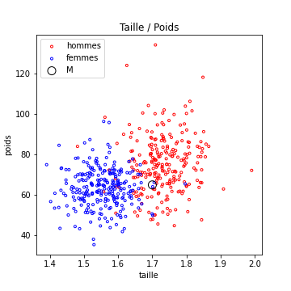
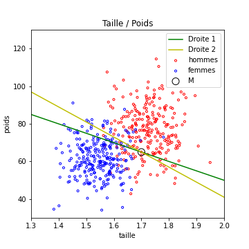
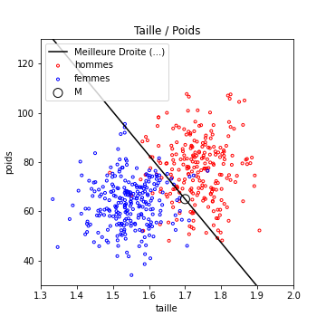
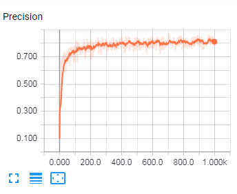

<script type="text/javascript" async src="//cdn.bootcss.com/mathjax/2.7.0/MathJax.js?config=TeX-AMS-MML_HTMLorMML"></script>
<script type="text/javascript" async src="https://cdnjs.cloudflare.com/ajax/libs/mathjax/2.7.1/MathJax.js?config=TeX-MML-AM_CHTML"></script>

# Cours 3


## Apprentissage par optimisation

La plupart des véritables algorithmes de machine learning sont de cette
catégorie. Pour vous expliquer ce que c'est, je vais me servir d'un exemple.

On reprend le problème de séparation hommes / femme,
avec comme caractéristiques : [taille, poids].

Je veux construire un algorithme qui va trouver la meilleure droite pour séparer
ces deux classes. Je sais de plus que cette droite passe par le point M marqué
en noir dans la figure suivante.



L'équation de n'importe quelle droite
(non verticale) passant par ce point (M[0],M[1]) est donc
$$y - p(x-M[0]) -M[1] = 0 $$, avec $$p \in R$$

Pour un paramètre *p* fixé (donc pour une droite donnée), si le
vecteur de caractéristiques est [x,y], la décision de notre algorithme est prise
de la façon suivante :
- si $$ y - p(x-M[0]) -M[1] > 0 $$ : on décide que c'est un homme,
- sinon, c'est une femme

La figure suivante présente 2 exemples de droites (donc deux algorithmes
  différents mais basés sur ce principe), dont les performances en Apprentissage
  sont différentes

  

Posez vous les questions suivantes :
- entre ces deux algorithmes, lequel est le meilleur ? (la réponse est : celui de la droite 2.)
- Peut on faire mieux ? (la réponse est oui)

Il s'agit donc de trouver le paramètres *p* qui donne les meilleurs
résultats. Meilleurs signifiant ici : avec la meilleure mesure de performance
en apprentissage. C'est un problème d'**optimisation**. Vous avez eu des cours
à ce sujet, je pense.

La solution la plus simple pour trouver une "bonne" solution
consiste à faire la chose suivante (en pseudo code)

```python
# On se donne une situation de départ
testp = -50

# On cree une variable pour mémoriser les meilleurs performances trouvées
bestPerreur = 1

# On crée une variable pour fixer le nombre d'essais maximum
nMax= 1000

# On crée une variable pour compteur les tests déja faits
n=0

# Puis on va chercher des meilleurs solutions.
while n < nMax:

  # on mesure les perf obtenues sur la base d'apprentissage avec ces paramètres.
  newPerreur = mesureProbaErreur(testp, baseApprentissage)

  # On met a jour les meilleurs perf trouvées et les meilleurs param trouvés
  if newPerreur < bestPerreur :
    p = testp
    bestPerreur = newPerreur

  # On génère une nouvelle configuration en deplacant testp
  # UN PETIT PEU et AU HASARD !
  testp+= random.random() *pas

  n+=1
```

Mon pseudo code fonctionne en python (sous réserve d'avoir fait la
fonction *mesureProbaErreur*). A ceci près que je n'ai pas fixé de valeur
à la variable *pas*... Cette variable s'appelle le **pas de la descente**.

A l'issue de cet algorithme :
- on aura testé 1000 possibilités pour p.
- en partant de (a0,b0)
- en conservant toujours la meilleur possible
- en essayant toujours juste à coté de la meilleure solution trouvée jusque là


Pour mieux comprendre la partie **descente stochastique** et cette histoire de **pas de la descente**, vous pourriez aller voir la page sur [la descente stochastique](./HyperLinks/descenteStochastique) qui contient notamment un lien vers du code exécutable (sur un exemple plus simple) que vous pourrez exécuter, modifier...

Pour information, voici les résultats trouvés sur ce jeu de test par cet algo :
```
pente : -177.35109477634492
proba d erreur : 0.086
```



Cet algo fonctionne !

La bonne nouvelle, c'est que vous
pouvez aller [le tester](https://colab.research.google.com/drive/18lgzZKC7N9-24rP62h3PlDY_ymPu5MsB). Je vous recommande d'essayer de changer **le pas**, **nMax** voir ce que cela change (et de comprendre pourquoi)...

**Recherche de plus d'un paramètre**

Le mode de fonctionnement est très similaire si l'algorithme travaille
avec plus d'un paramètre.

Imaginons que je ne sache pas placer le point *M*.
Les droites que je cherche ont pour équation par **y - px -b = 0**. Je cherche donc le meilleur couple (p,b).

Sauriez vous adapter l'algo précédent ?

Il suffit, en gros, de changer :
- la description de la configuration initiale.
- la génération de nouvelle configuration

Cette méthode simple mais efficace rentre dans la grande catégorie des
[algorithmes d'optimisation](HyperLinks/algoOptim.md) qui servent à peu près
à tout (notamment à trouver les poids d'un réseau de neurones)


Pour information, l'algo que nous avons vu fait partie de la classe des
algorithmes dits "**de Monte carlo**". Le paramètre **pas de la descente**
évoqué dans notre exemple se retrouve dans toutes ces méthodes,
sous une forme ou une autre. Il faut souvent l'adapter au problème traité.


## Évolution des performances pendant l'apprentissage

On voit dans le pseudo code qui précède, que l'algo va en fait voir
la totalité de la base de nombreuses fois (1000 fois)

Au fur et à mesure des essais, la probabilité d'erreur devrait
diminuer. Dit autrement, la **précision en apprentissage** doit
augmenter avec le temps, pendant l'apprentissage.

Elle doivent (si tout se passe bien) évoluer de la façon suivante :




*La figure précédente est en fait tirée des tests effectués par l'un d'entre vous sur de la reconnaissance de caractères à partir d'images (à l'aide d'un réseau de neurones). Il y a 10 classes possibles, l'algorithme a donc, en tirant au hasard sa réponse, une probabilité
de succès de 0.1. Ce sont les performances au début de l'apprentissage.
On voit qu'il progresse, puis stagne.*

On voit que notre algorithme a atteint, à la fin de son apprentissage, une
précision en apprentissage d'à peu près 0.80.
La valeur finale est peu importante (elle dépend de la qualité de l'algorithme
et de la difficulté du problème). Par contre, on voit qu'il ne sert plus à rien
de continuer à entraîner cet algorithme, il a déjà atteint ses limites depuis
longtemps.

Je vous rappelle que ces performances ne sont toutefois pas une évaluation
correcte de ce que ferait notre algorithme en situations réelles, car il est
ici évalué sur des exemples qu'il connaît déjà.

On doit donc mesurer maintenant sa probabilité de classification correcte sur la
**base de généralisation**.

Dans le cas correspondant à l'image présentée au dessus
dessus, la probabilité de classification correcte en généralisation était de
0.76.

- Qu'en déduisez vous ? (réponse : pas d'overfitting, il faudra **améliorer le
modèle** pour avoir de meilleures performances)


TODO :
- Ajouter un test en généralisation dans le test de recherche de meilleure Droite...

- Illustrer l'evolution des performances avec l'algo de recherche de Meilleure Droite.


___

Vous pouvez passer au [Cours 4](04_cours4.md) ou  repartir vers le [Sommaire](99_sommaire.md)
___
