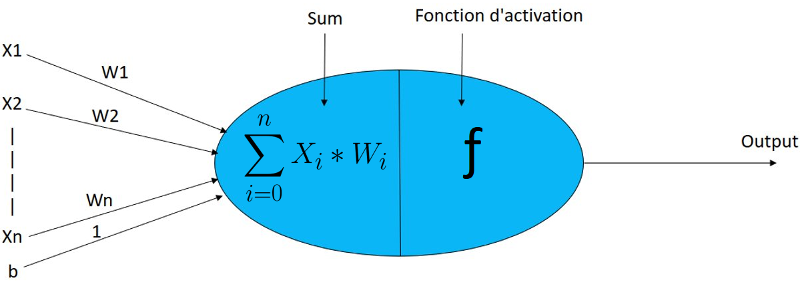
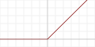
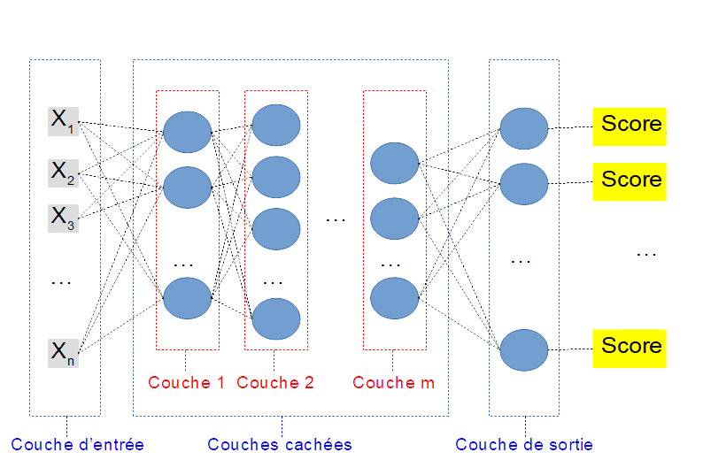

# Introduction aux Réseaux de Neurones.
(*niveau de base*)

## Introduction
Ne nous le cachons pas, c'est ce à quoi l'on pense, ces jours ci,
lorsque l'on pense aux techniques d'IA.
Quand on parle de **Classification** ou de **Régression** (pas trop pour le
clustering), ils ont, à proprement parler, **écrasé toutes les autres techniques**.

Il faut noter que **ce ne sera vraisemblablement pas toujours le cas**. Il y a eu des modes en machines learning (*la théorie bayesienne* du début a cédé la place
aux *arbres de décision* qui ont été parfois supplantés par les *svm*...).
Maintenant, ce sont les réseaux de neurones qui dominent le domaine de l'Apprentissage Automatique.

Pourtant, ces réseaux existent depuis 1960...
Ce qui a changé et a permis leur domination absolue actuelle, c'est une conjonction des facteurs suivants :
- des développements récents (pas si récents) : les réseaux convolutionnels...
- une augmentation énorme des puissances de calcul
- la possibilité d'accéder à des bases de données énormes et nombreuses (par exemple, www.kaggle.com, mais je ne suis pas là pour leur faire de la pub).
- des **frameworks de développement** très matures (*Tensor Flow*, *Torch*, ...)
qui rendent leur programmation suffisamment aisée pour que les entreprises puissent
envisager de les utiliser **sans avoir besoin d'un réel spécialiste**.

Il faut tout de même noter que cette nouvelle *mode* se distingue des précédentes
par un point majeur que nous allons voir maintenant.

### Ampleur des améliorations obtenues avec eux
L'ampleur de l'amélioration qu'ils ont amenés (dans leurs formes récentes) est sans commune mesure avec les améliorations précédentes.

Avant, une amélioration permettait de gagner quelques points sur le pourcentage
de décisions correctes.

Les réseaux de neurones ont tellement bien réussi qu'il est difficile de les départager sur les anciennes bases d'exemples (sur la base *MNIST*, les versions
élaborées performent toutes avec une proba de classification correcte au dessus de 0.98 par exemple).

Il a fallu **créer de nouvelles bases** constituant des problèmes plus difficiles.
Par exemple, un problème classique, avant, était la reconnaissance d'un chiffre
manuscrit (10 classes possibles) dans des images de taille identiques (28x28 pixels). C'etait la base *MNIST*.

Le problème correspondant à la base *Image.Net* est de reconnaitre quels objets apparaissent (1000 classes possibles), dans des images de taille variable. Je n'ai pas connaissance d'algo autre que les réseaux de neurones pouvant s'attaquer à cela (*je vais chercher parce que maintenant que je le dis, il doit bien y avoir un gars quelque part qui essaye*).

Dans certains cas, ils ont, **de mon point de vue**, tué des champs de recherche !
Dans ma spécialité de recherche initiale, le traitement d'image, un bon chercheur
avait entre autres compétences, une très bonne capacité à savoir [extraire les caractéristiques](extractFeatures.md) des images à traiter. La complexité des méthodes d'extraction pouvait être redoutable. Le truc, c'est que les réseaux
de neurones choisissent eux même quelles caractéristiques extraire, mieux que
quiconque. Je considère donc que le traitement d'image est devenu, dans sa plus grande part et à l'heure actuelle, une simple application des réseaux de neurones.
*(Certains de mes collègues ici ne sont vraisemblablement pas d'accord avec moi)*

Sans forcément parler de révolution
(*seul l'avenir nous le dira, à l'échelle d'une vie humaine*),
nous sommes donc en train de vivre un saut technologique très net.

## Principe de fonctionnement.

Passons en vitesse sur le fait que ce modèle s'inspire de la biologie (c'est vrai, mais ce modèle serait très simpliste s'il s'agissait de simuler des neurones
biologiques). Je ne fais pas de recherche en **Connectionnisme**. Ce qui nous intéresse dans ce cours, c'est la capacité de nos modèles à apprendre (je fais
de la recherche **Machine Learning**).

Voici donc comment ils fonctionnent. Au coeur de ces réseaux, il y a ... des **Neurones artificiels**.

### Le neurone artificiel classique

Le neurone standard en informatique prend des valeurs en entrée ($${x_ix, i \in {1,...n}}$$) et calcule une sortie en fonction des entrées et de paramètres
internes ($${w_i , i \in {0,...n}}$$ ). C'est bien une petite **unité de calcul** élémentaire dont la puissance viendra de sa mise en réseau.

Son fonctionnement est décrit dans la figure suivante :

En gros : le neurone associe à chaque entrée un poids spécifique.
En fonction des valeurs observées sur les entrées, le neurone calcule alors
la **somme des entrées, pondérées par leur poids respectif**.

L'expression en est la suivante :

$$ S = \sum_{i =1..n} w_i.x_i + w_0$$

Remarque : *Si vous regardez bien l'équation précédente, vous voyez qu'il y a
un poids $$ w_0$$ qui n'est associé à aucune entrée*. On l'appelle le **biais**
du neurone (dans la pratique, c'est pris en compte automatiquement...). *Il est noté b dans la figure, qu'il faut que je refasse...*

Au début des réseaux de neurones (1960), les neurones fonctionnaient comme cela.
Mais dans ce cas, le neurone ne fait qu'une **combinaison linéaire de ses entrées**,
ce qui lui donne des capacités limitées. Il est très rapidement apparu très utile
d'ajouter au neurone un étage : sa **fonction d'activation**

La fonction d'activation est une fonction **non linéaire** qui prend en entrée
la somme pondérée et la transforme. Une fonction courante pour cela est
la fonction **ReLU**, dont voici le graphe :

La sortie de la fonction d'activation est la **sortie du neurone** ($$y$$).
Dans le cas de la fonction ReLU, le fonctionnement du neurone est donc le suivant :

1. Le neurone calcule la somme pondérée des entrées $$S$$
2. le passage de cette somme S dans la fonction d'activation donne la sortie $$y$$ du neurone :
  - Si $$S>0$$, alors $$y= S$$
  - Sinon $$y = 0$$

Il existe de nombreuses autres [fonctions d'activations](HyperLinks/activations.md).
Elles obéissent toute plus ou moins (sauf cas très spécifique) à l'idée suivante :
Plus la somme pondérée des entrées est grande, plus la sortie est grande.

L'idée derrière tout ces calculs est la suivante : un neurone va synthétiser les informations qui lui parviennent (ses entrées), de façon personnalisée (en fonctions de *ses* poids). Il décidera alors de réagir avec une sortie plus ou
moins grande.

### Le Réseau de neurones à couches en classification

Un **réseau de neurone** consiste simplement à connecter des neurones entre eux :
La sortie d'un neurone constitue une entrée pour un ou plusieurs autre neurones.

Le réseau de neurones le plus classique est construit avec une **architecture** en **couches**. Comme il sera souvent appliqué à des problèmes de **classification**, une architecture dédiée à ce type de problème est présentée dans la figure suivante :

On trouve dans cette architecture 3 types de couches différentes :
- La **couche d'entrée**, qui reçoit les données (les **caractéristiques** de l'objet à classifier)
- Zéro, une ou plusieurs **couches cachées**, qui permettent de traiter les données.
- La **couche de sortie** qui présente **autant de neurones que le problème a de classes**.

Ainsi, quand on communique des caractéristique à un réseau de neurone, chaque neurone de sortie calcule un **score pour la classe correspondante**.

La **décision du réseau** pour un exemple donnée est prise en regardant **quel neurone de sortie a la sortie la plus grande**

Reprenons cela sous forme plus mathématique : soit $$y_i$$ les sorties
de chaque neurone de la couche de sortie pour un certain exemple. La décision $$d$$ du réseau pour cet exemple est la classe $$d$$, avec $$d = argmax_i y_i$$.

C'est bien un fonctionnement de [fonctions Discriminantes](HyperLinks/discriminantFunctions.md).

### Les poids du réseau de Neurones et exemple d'application

Ils sont primordiaux puisque ce sont eux qui déterminent les sorties du réseau
pour une entrée particulière. Chaque neurone a autant de poids qu'il a d'entrées,
plus une (pour le biais). Ces poids sont les **paramètres libres** de notre réseau, qu'il faudra régler pendant la **phase d'apprentissage**.

Prenons un exemple. Nous voulons toujours classifier des individus selon leur sexe, en fonction de leur taille et de leur poids (*Non, ce n'est pas une obsession...*).

- Notre réseau aura 2 entrées (une pour la taille, une pour le poids)
- Notre réseau aura 2 sorties (une pour les hommes, une pour les femmes)
- Je décide de façon arbitraire de mettre entre les deux 2 couches cachées, de 5 neurones chacune.

Le nombre de paramètres libres est donc :
- première couche : chaque neurone à 2 entrées, et un biais -> $$5.(2+1)$$ poids
au total.
- seconde couche, complètement connectée à la première. chaque neurone à 5 entrées (autant que de neurones sur la premiere couche -> $$5. (5+1)$$ poids au total.
- couche de sortie : chaque neurone à 5 entrées -> $$2.(5+1)$$ poids au total.

Soit un total de $$15+30+12=57$$ paramètres libres pour notre réseau.

Avant l'apprentissage, ces poids sont fixés **aléatoirement**. Le réseau prend
donc ses décisions initialement **au hasard**.

L'**apprentissage supervisé** (vu au cours précédent) va consister à :

- lui présenter des exemples
- lui faire calculer sa réponse
- puis **corriger ses poids** de façon a améliorer sa réponse la prochaine fois
qu'il verra cet exemple.

On cherche ainsi les meilleurs poids possibles pour la base d'exemple,
ce que vous traduirez naturellement en : c'est un problème d'**optimisation de paramètres**, qui sous-entend vraisemblablement une descente stochastique...

A l'issue de l'apprentissage, les poids sont considérés comme appris, et
comme pour tout algo d'apprentissage supervisé, on évaluera ses performances
à l'aide d'une **base de validation**.

Un peu plus de détails sur cet exemple figure dans la page [exemple Simple DNN](HyperLinks/simpleDNN.md)

Vous pouvez passer au [Cours 5](05_cours5.md) ou  repartir vers le [Sommaire](99_sommaire.md)

TODO.
