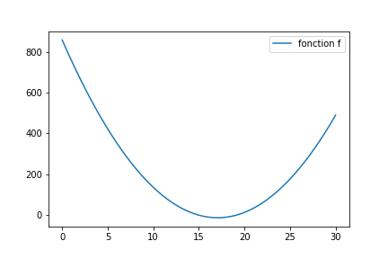
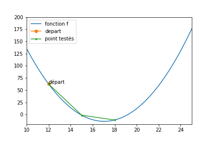
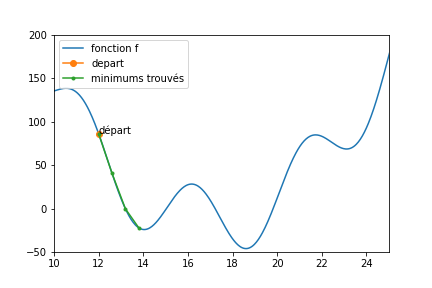

# Principe des algorithmes de descente stochastiques
(niveau 1)

## Principe de base

Par algorithme de descente, j'entends un algo qui cherche le minimum
d'une fonction.

Ils sont tous basés sur le principe suivant, avec des variantes (voir [Algos de
descente](algosDescente.md)), que l'on a déja vu dans le [cours 2](../02_cours2.md) :

```python
configTestee = pointDepart # pointDepart peut, au pire, etre choisi aléatoirement

bestResu = math.inf
bestConfig = None
n=0
while (bestResu > valMin or n> nMax):
  print (configTestee, bestConfig, bestResu)

  resu = aMinimiser(configTestee)
  if resu < bestResu:
    bestConfig = configTestee
    bestResu = resu

  configTestee = genererNouvelleConfig(bestConfig, pas)
  n+=1
```

Imaginons que je souhaite trouver le minimum de la fonction suivante.



Ce qui nous intéresse est cette fonction *genererConfig* qui va présenter au
programme la nouvelle configuration à tester. Au plus simple :

je me déplace, de la quantité *pas*, soit à gauche soit à droite (direction tirée au hasard). (vous pouvez regarder cette [remarque](remarqueDescente.md))

Voici une figure qui présente les meilleurs solutions trouvées lors d'une descente :
- Le point de départ est indiqué en vert
- le pas était de 3
- nMax valait 5



Evidemment, une fois arrivé en x=18,
l'algo ne peut pas faire mieux.
- Soit il retourne en 15 (moins bien)
- soit il part en 21 (moins bien)

Donc on trouve une solution proche du minimum, mais pas très proche.

## Choix d'un pas

Vous vous direz peut être qu'il suffit de baisser le **pas** :

oui, mais :
- au départ, je n'ai aucune idée de la
précision qu'il me faut choisir. En soi, 3 n'est pas mieux ou moins bien que 0.01. La forme spécifique de ma fonction à minimiser influe sur le choix optimal de *pas*
- si on part de plus loin que 12, on en 5 itérations, on ne va pas
explorer suffisamment de points pour s'approcher du minimum. Dans les cas courants, je n'ai aucune idée de la distance qui sépare mon point de départ du minimum (je ne sais pas ou est ce minimum).

Vous me direz qu'il suffit d'augmenter
le nombre d'itérations :

Oui, mais le **temps de calcul va potentiellement augmenter de facon
énorme**

Pour mieux comprendre ce qui précède (et la suite), vous pouvez vous rendre sur Colab, je vous ai préparé [cet exemple](https://drive.google.com/open?id=14X1XDchFWoQZZnSW6Jnwp89hqGV0ySCC), que vous pourrez exécuter, modifier...
Je vous conseille **vivement** de tester des choses.

*De façon générale, dans la vie, je conseille vivement de tester des choses (si ce n'est pas trop dangereux)*

Vous pouvez déja retenir que :
**Le choix du pas résulte d'un compromis entre qualité de la solution et temps de calcul**

## Minimum Global et Minimum Local

Attention, les fonction dont je voudrais trouver un minimum ne sont pas forcément
aussi sympathique que celle que j'avais prise en exemple ci dessus.

Regardez par exemple celle ci :


Une descente stochastique peut tout a fait donner ceci (le code exécutable en ligne est au même endroit que pour la fonction simple.)



On dit que la fonction présente des
**minima locaux** (il y en a trois dans [10,25], et à l'oeil, 4 au total)

Si ma fonction présente des minima locaux, une descente stochastique ne garantit pas de trouver le **minimum global** de la fonction (le plus petit des minimum locaux)

Si vous tombez sur le minimum global (et vous ne le saurez en fait jamais), c'est que vous avez eu **beaucoup de chance**.

Est ce un problème ? Oui et non, nous allons le voir

## Application des descentes stochastiques aux algorithmes d'apprentissages supervisés
*vous avez vu ? Ça commence à faire des chouettes titres de section qui font peur aux enfants...*

Reprenons le problème de classification qui vous a amené ici.
Nous cherchions la meilleure droite possible pour séparer deux paquets de points (celle avec la meilleure pente).

Pour cela, nous avons choisi de trouver le meilleur paramètre (la meilleure pente) en minimisant la
probabilité d'erreur mesurée sur la base d'apprentissage, à l'aide d'une descente stochastique. (*cette phrase aussi pique un peu*)

Ayant lu ce qui précède, vous devez normalement vous demander :
**Sommes nous plutôt dans le cas d'une fonction simple (convexe)
ou d'une fonction présentant des minima locaux ?**

La réponse est simple : **il y a des minima locaux**. *(à vrai dire, il y en a un nombre sans doute à peu près proportionnel au nombre d'exemples de la base d'apprentissage, ça mériterait presque une remarque de niveau 2 ou 3)*

Donc une descente stochastique va nous donner une droite qui n'est pas la meilleure (sauf si on a beaucoup de chance).

Mais cette droite correspond à un algorithme. Du coup :
- Si les performances de cet algorithme sont suffisantes pour
votre problème, ben c'est bon. Ce n'est pas le meilleur, mais il fera l'affaire.
- Sinon, il vous reste trois choix :
  - changer d'[algorithme d'optimisation](algoOptim.md), pour qu'il soit moins sensible aux minima locaux.
  - changer de [mesure de performance](perfMeasures.md) (minimiser autre chose que la proba d'erreur)
  - changer de [modèle](HyperLinks/qualiteModele.md) (arreter de chercher des droites)

Voilà !
