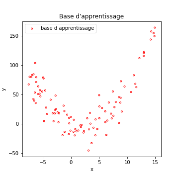
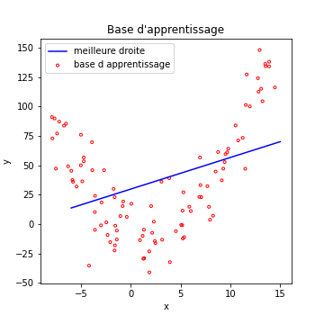
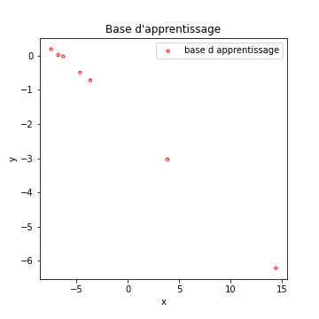
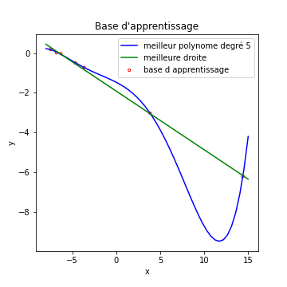
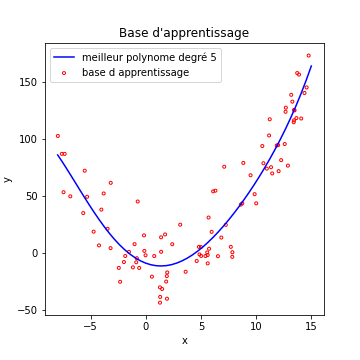

# Sur Apprentissage et Sous Apprentissage
*(niveau 1)*

- Le **sur apprentissage** est appelé *overfitting* en anglais.
- Le **sous apprentissage** est appelé *underfitting* en anglais.

Pour vous expliquer cela, commencons par voir les choses d'un peu loin :
Un algo d'apprentissage automatique va produire une fonction de prédiction.
Cette fonction doit normalement capturer toutes les propriétés
de chaque caractéristique et les corrélations entre caractéristiques.

Ce que l'algorithme extrait est **spécifique au Training Set**.
Une condition **nécessaire** pour que notre algorithme fonctionne bien dans le
cas général est que cette base d'apprentissage soit représentative du problème général.

Mais cette condition n'est pas **suffisante**.

Commencons par le sous apprentissage, c'est plus simple.

## Sous Apprentissage

Imaginons les données suivantes :

Comme d'habitude, vous trouverez le code ayant permis de générer cette courbe ainsi que toutes celles de cette page dans un fichier
exécutable en ligne [en cliquant ici](https://colab.research.google.com/drive/1TEIwklju8ne4tAgWMERdbJ9WW1fA3zga).

Si l'on tente une régression linéaire sur ces données, évidemment, ca ne marche pas très bien...

La régression linéaire cherche la **meilleure droite** correspondant aux données. Dans ce cas, même la meilleure des droites ne peut avoir que des performances très mauvaises.

On dit que notre modèle souffre de **sous apprentissage**. Il est incapable de s'adapter correctement aux données de la base *(l'équivalent dans un problème de classification, serait un modèle avec une accuracy faible en apprentissage)*.

Dit autrement, notre modèle n'est pas suffisamment complexe pour s'adapter aux données. C'est le sens du **sous apprentissage**.

Il faudrait disposer d'un modèle plus complexe.

Si l'on est confronté à un problème de sous apprentissage dans le cas des réseaux de neurones, il faudrait par exemple (et au choix) :
- ajouter des neurones dans les couches cachées
- ajouter des couches cachées...

Voyons donc son frère...

## Sur Apprentissage

Reprenons de nouveaux exemples, ce sera plus parlant...
Imaginons les données suivantes :

Echaudé par l'histoire de l'underfitting, je décide de créer un modèle de régression qui cherche le meilleur polynome de degré 5 qui fit mes données...

Le résultat est la courbe bleue de la figure qui suit

Que voit on dans ces courbes :
- notre bête modèle de régression linéaire, en vert, fait le boulot correctement, ce coup ci.
- l'algorithme qui utilise un polynome de degré 5 trouve une solution, disons...bizarre.

Voyons ceci plus en détail :
En fait, **la courbe bleue commet une erreur beaucoup plus faible sur la base d'apprentissage que la droite verte**.

L'algorithme a quasiment appris par coeur chaque exemple de la base d'apprentissage, **au détriment de sa capacité à généraliser**. On voit par exemple que sa prédiction pour x= 12 est pour le moins fantaisiste (y_pred = -9)

Ici, notre modèle est trop complexe *(en particulier pour un nombre d'exemples aussi faible)*

Il est donc primordial de disposer de modèles dont la complexité n'est :
- ni trop faible (sous apprentissage)
- ni trop élevée (sur apprentissage)

Une note d'espoir tout de même :
voyons notre polynome de degré 5 sur la premiere base d'exemples...

On voit que notre polynome de degré 5 arrive a fitter nos données correctement, alors qu'elles suivent un polynome de degré 2. Ce qui nous sauve du sur apprentissage, c'est le nombre d'exemples assez élevé pour que le modèle ne puisse pas "apprendre par coeur" ces exemples.

## Implications pour l'apprentissage automatique, et règles actuelles

Prenons un problème actuel de classification.

Vous êtes dans un cas de :
- sous apprentissage si votre **accuracy** est faible.
- sur apprentissage si vos performances en généralisations sont significativement plus faibles que vos performances en apprentissage.

Si par exemple, votre **accuracy** vaut :
- 0.94 en apprentissage
- 0.75 en généralisation

c'est du **sur apprentissage**.

Si votre **accuracy** vaut 0.75 en apprentissage, c'est du **sous apprentissage**.

Actuellement, on considère, pour les réseaux de neurones, qu'il faut commencer **par créer un modèle capable de sur apprentissage**.

On utilise alors des techniques telles que :
- l'**augmentation de données**
- le **drop out**
- la **régularisation des poids**

pour lutter contre ce sur apprentissage et obtenir un algorithme qui soit aussi près que possible des performances optimales compte tenu de la [difficulté intrinsèque du probleme](difficultePb.md).

Ces techniques ne seront pas détaillées dans ce cours, mais je vous invite a chercher sur le net si vous en sentez l'envie ou le besoin.
