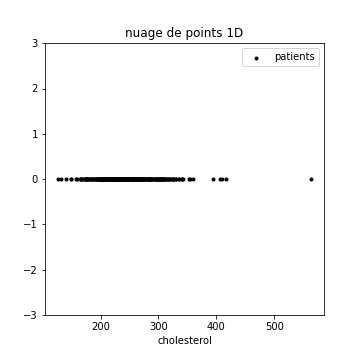
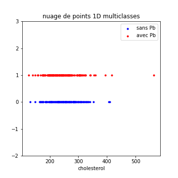
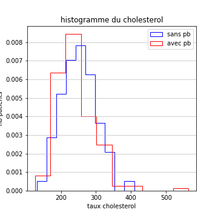
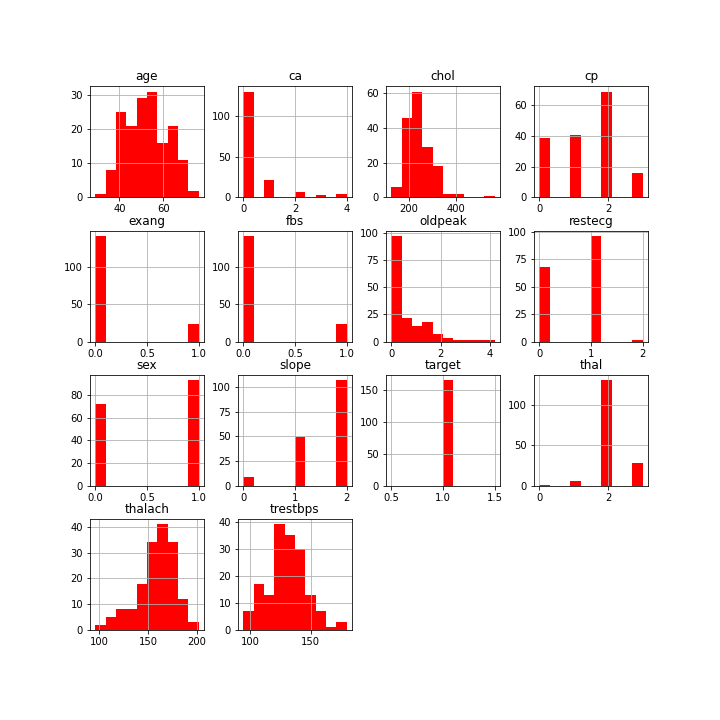
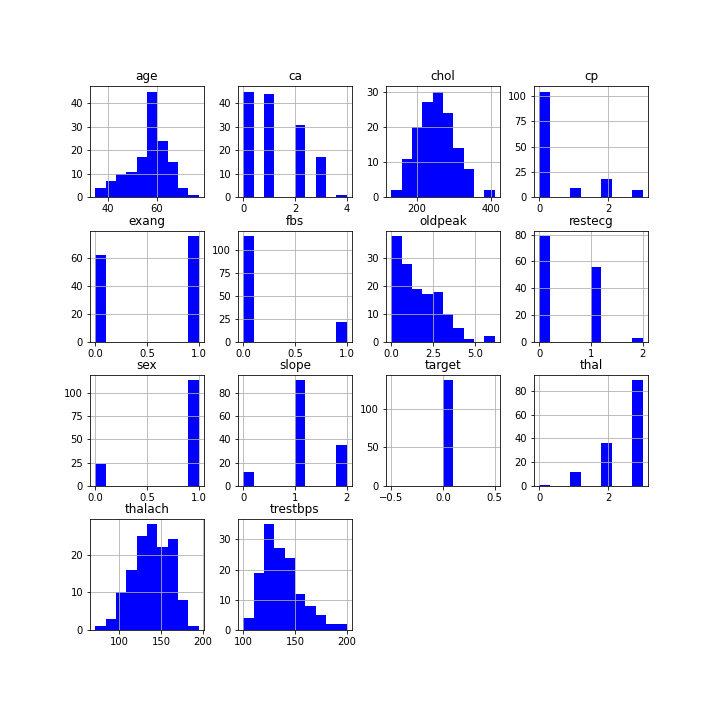
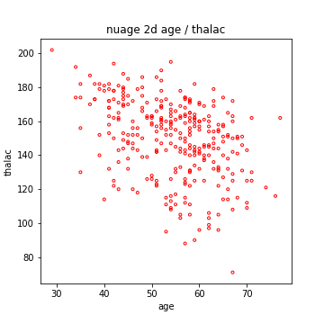
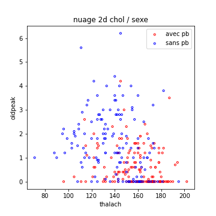
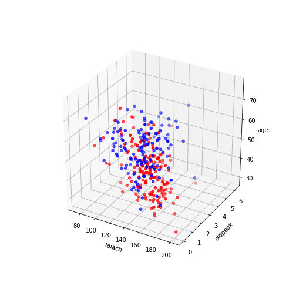

# Visualiser ses données
(niveau 1)

Comme nous l'avons vu, visualiser ses données est primordial.
Tous ces exemples sont tirés
d'un Jupyter Notebook beaucoup
plus détaillé que vous trouverez
en suivant [ce lien](https://colab.research.google.com/drive/1ldDfR920DUphSNt4Pevkn1SjeUa7ic7m).
je vous conseille vivement d'aller le regarder...

## Visualisation d'une seule caractéristique

Imaginons que l'on veuille observer la répartition d'une caractéristique
des exemples dont on dispose.
Le plus simple est de regarder le nuage de points 1d de cette caractéristique.

### Nuage de Points

Il pourrait être intéressant de visualiser la charactéristique pour chacune des classes possibles.

### histogrammes

Ils permettent d'observer la distribution d'une caractéristique.
Dans la figure qui suit, l'ordonnée est normalisée pour être homogène à une densité de probabilité...

On peut faire ceci pour toutes les caractéristiques :

Ceci permet par exemple de se redre compte que *talach* et *thal* semblent etre intéressants pour détecter partiellement
les pb cardiaques (j'ai regardé vraiment rapidement)...

## Visualisation de deux caractéristiques

Si on ne regarde les caractéristiques que l'une après l'autre, on peut passer à côté d'informations primordiales, concernant les **liens statistiques** entre les caractéristiques.

On voit clairement que la seconde caractéristique (*thalach*) diminue en moyenne lorsque l'age augmente.

Une page est dédiée à l'analyse de ces [liens statistiques](liensStat.md)

Il peut arriver en **classification** que l'information ne soit pas portée par deux caractéristiques prises séparément, mais que le couple de ces caractéristiques soit très pertinent.

(je n'ai pas *encore* trouvé d'exemple de ceci dans mon analyse de ma base)

En revanche, le graphe suivant montre clairement que le couple thalach / oldpeak permet de discriminer pas mal les patients atteints de problèmes cardiaques et les autres.

Ceci serait très utile si par exemple je ne devais conserver que quelques caractéristiques pour **réduire la dimension du problème**.

## Visualisation de trois caractéristiques

Je vous mets ci dessous un nuage 3D. C'est beau et parfois utile, mais surtout si on peut le faire tourner pour l'observer sous plusieurs angles...

Voila, un bref apercu de ce que l'on peut faire en visualisation de données,
notamment pour **choisir les caractéristiques les plus pertinentes**.
